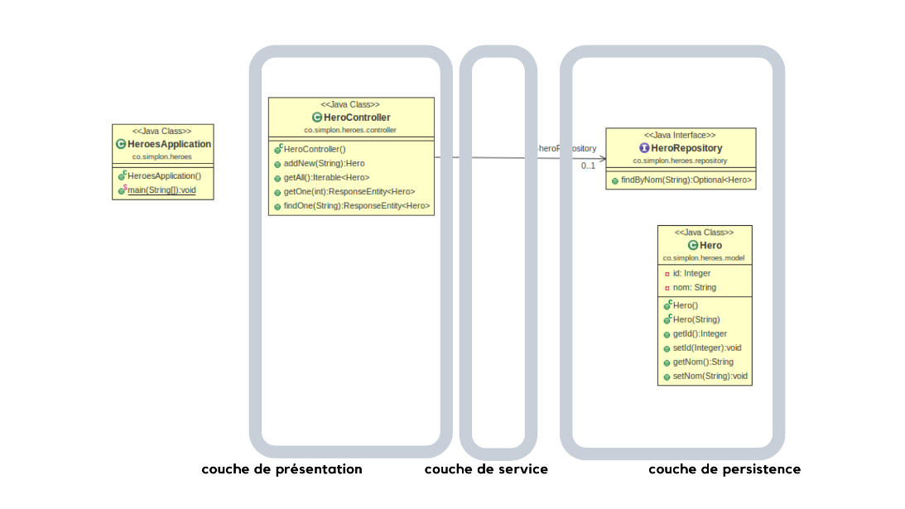
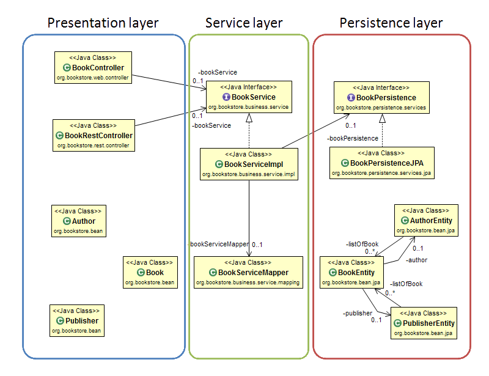

# heroes-backend-tests

#### But
> Le but de ce projet est tester isolément  les couches (*layers*) d'une application MVC structurée avec spring.

Voici un diagramme de notre application :

Voici un exemple de diagramme d'une autre application avec une couche de service : 

from <https://sites.google.com/site/telosystutorial/springmvc-jpa-springdatajpa/presentation/spring-mvc---jpa>

#### Principe
> Pour faire ça, on va tester couche par couche et simuler (*mock*) les autres couches. 

Notre application est constituée d'une classe `HeroesApplication`, le point d'entrée. Puis d'un package controller, d'un package repository et d'un package model.

Nous n'avons pas comme dans l'illustration de service, car il n'y a pas d'action métier particulière à faire (ici, que des accès à la base de donnée). 

Le package model ne contient que des entités simples, donc rien à tester.

Les tests que nous avons développé sont : 
- tests du controller (on mocke le repository)
- tests du repository (on mocke la bdd)
- tests d'intégration (on ne se moque plus^^, on teste toute la chaine)
- un test de démarrage (qu'on peut lancer au début pour voir si l'application démarre bien sans erreur)

#### Liens
- Référence pour une appli SpringBoot mysql : <https://spring.io/guides/gs/accessing-data-mysql/>

- Tester controller, repo, integration : <https://dzone.com/articles/unit-and-integration-tests-in-spring-boot>